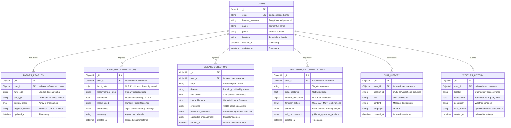

# KRISHI AI – Database Design (MongoDB Schema)

```mermaid
erDiagram
    USERS ||--o{ FARMER_PROFILES : "has profile"
    USERS ||--o{ CROP_RECOMMENDATIONS : "requests"
    USERS ||--o{ DISEASE_DETECTIONS : "uploads"
    USERS ||--o{ FERTILIZER_RECOMMENDATIONS : "calculates"
    USERS ||--o{ CHAT_HISTORY : "participates"
    USERS ||--o{ WEATHER_HISTORY : "queries"

    USERS {
        ObjectId _id PK
        string email UK "Unique indexed email"
        string hashed_password "Bcrypt hashed password"
        string name "Farmer full name"
        string phone "Contact number"
        string location "Default farm location"
        datetime created_at "Timestamp"
        datetime updated_at "Timestamp"
    }

    FARMER_PROFILES {
        ObjectId _id PK
        ObjectId user_id FK "Indexed reference to users"
        string farm_size "Landholding (acres/ha)"
        string soil_type "Dominant soil classification"
        array primary_crops "Array of crop names"
        string irrigation_source "Borewell / Canal / Rainfed"
        datetime updated_at "Timestamp"
    }

    CROP_RECOMMENDATIONS {
        ObjectId _id PK
        ObjectId user_id FK "Indexed user reference"
        object input_data "N, P, K, pH, temp, humidity, rainfall"
        string recommended_crop "Primary predicted crop"
        float confidence "Model confidence (0.0 - 1.0)"
        string model_used "Random Forest Classifier"
        array alternatives "Top 3 alternative crop rankings"
        string reasoning "Agronomic rationale"
        datetime created_at "Indexed desc timestamp"
    }

    DISEASE_DETECTIONS {
        ObjectId _id PK
        ObjectId user_id FK "Indexed user reference"
        string crop "Predicted plant name"
        string disease "Pathology or Healthy status"
        float confidence "CNN softmax confidence"
        string image_filename "Uploaded image filename"
        array symptoms "Visible pathological signs"
        array prevention_methods "Preventive agronomic practices"
        array suggested_management "Control measures"
        datetime created_at "Indexed desc timestamp"
    }

    FERTILIZER_RECOMMENDATIONS {
        ObjectId _id PK
        ObjectId user_id FK "Indexed user reference"
        string crop "Target crop name"
        float area_hectares "Cultivated area"
        object nutrient_deficiency "N, P, K deficit status"
        array fertilizer_options "Urea, DAP, MOP combinations"
        array schedule "Basal and top dressing stages"
        array soil_improvement "pH lime/gypsum suggestions"
        datetime created_at "Timestamp"
    }

    CHAT_HISTORY {
        ObjectId _id PK
        ObjectId user_id FK "Indexed user reference"
        string session_id "UUID conversational grouping"
        string role "user or assistant"
        string content "Message text content"
        string language "en or hi"
        datetime created_at "Indexed timestamp"
    }

    WEATHER_HISTORY {
        ObjectId _id PK
        ObjectId user_id FK "Indexed user reference"
        string location "Queried city or coordinates"
        float temperature "Temperature at query time"
        string description "Weather condition"
        string data_source "openweathermap or indicative"
        datetime created_at "Indexed timestamp"
    }
```
