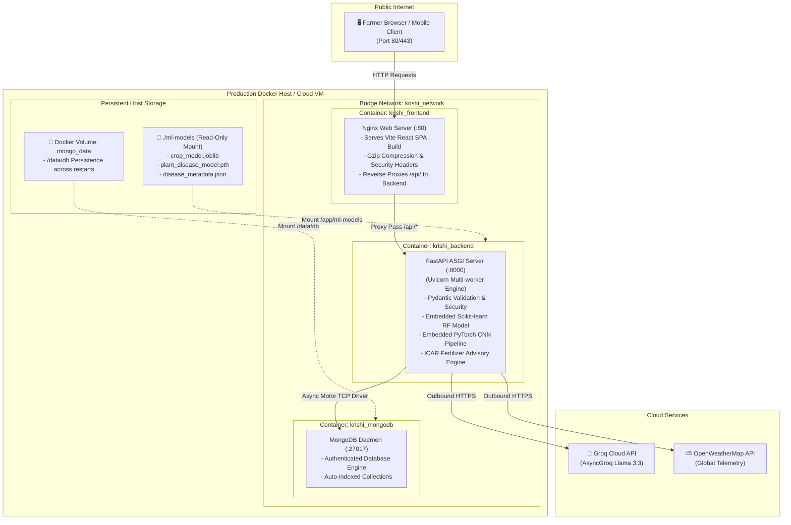

# KRISHI AI – Deployment Architecture

```mermaid
flowchart TD
    subgraph Internet["Public Internet"]
        Browser["🖥️ Farmer Browser / Mobile Client\n(Port 80/443)"]
    end

    subgraph HostServer["Production Docker Host / Cloud VM"]
        subgraph DockerNetwork["Bridge Network: krishi_network"]
            
            subgraph FrontendContainer["Container: krishi_frontend"]
                NginxServer["Nginx Web Server (:80)\n- Serves Vite React SPA Build\n- Gzip Compression & Security Headers\n- Reverse Proxies /api/ to Backend"]
            end

            subgraph BackendContainer["Container: krishi_backend"]
                FastAPIServer["FastAPI ASGI Server (:8000)\n(Uvicorn Multi-worker Engine)\n- Pydantic Validation & Security\n- Embedded Scikit-learn RF Model\n- Embedded PyTorch CNN Pipeline\n- ICAR Fertilizer Advisory Engine"]
            end

            subgraph DBContainer["Container: krishi_mongodb"]
                MongoServer["MongoDB Daemon (:27017)\n- Authenticated Database Engine\n- Auto-indexed Collections"]
            end
        end

        subgraph HostStorage["Persistent Host Storage"]
            ModelVolume["📂 ./ml-models (Read-Only Mount)\n- crop_model.joblib\n- plant_disease_model.pth\n- disease_metadata.json"]
            MongoVolume["💾 Docker Volume: mongo_data\n- /data/db Persistence across restarts"]
        end
    end

    subgraph ExternalCloud["Cloud Services"]
        GroqCloud["🤖 Groq Cloud API\n(AsyncGroq Llama 3.3)"]
        WeatherCloud["⛅ OpenWeatherMap API\n(Global Telemetry)"]
    end

    %% Network links
    Browser -->|HTTP Requests| NginxServer
    NginxServer -->|Proxy Pass /api/*| FastAPIServer
    FastAPIServer -->|Async Motor TCP Driver| MongoServer
    FastAPIServer -->|Outbound HTTPS| GroqCloud
    FastAPIServer -->|Outbound HTTPS| WeatherCloud

    %% Storage links
    ModelVolume -.->|Mount /app/ml-models| BackendContainer
    MongoVolume -.->|Mount /data/db| DBContainer
```
