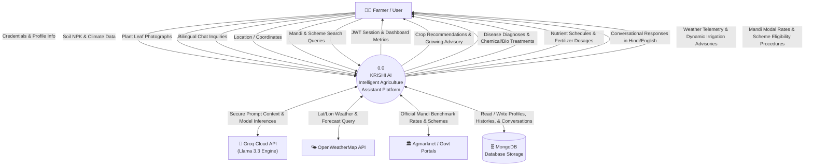

# KRISHI AI – Data Flow Diagram (DFD Level 0: Context Level)

```mermaid
flowchart TD
    Farmer["👨‍🌾 Farmer / User"]
    System(("0.0\nKRISHI AI\nIntelligent Agriculture\nAssistant Platform"))
    GroqAPI["🤖 Groq Cloud API\n(Llama 3.3 Engine)"]
    OpenWeather["🌤️ OpenWeatherMap API"]
    GovPortals["🏛️ Agmarknet / Govt Portals"]
    Database[("🗄️ MongoDB\nDatabase Storage")]

    %% Inputs from Farmer
    Farmer -->|Credentials & Profile Info| System
    Farmer -->|Soil NPK & Climate Data| System
    Farmer -->|Plant Leaf Photographs| System
    Farmer -->|Bilingual Chat Inquiries| System
    Farmer -->|Location / Coordinates| System
    Farmer -->|Mandi & Scheme Search Queries| System

    %% Outputs to Farmer
    System -->|JWT Session & Dashboard Metrics| Farmer
    System -->|Crop Recommendations & Growing Advisory| Farmer
    System -->|Disease Diagnoses & Chemical/Bio Treatments| Farmer
    System -->|Nutrient Schedules & Fertilizer Dosages| Farmer
    System -->|Conversational Responses in Hindi/English| Farmer
    System -->|Weather Telemetry & Dynamic Irrigation Advisories| Farmer
    System -->|Mandi Modal Rates & Scheme Eligibility Procedures| Farmer

    %% External Exchanges
    System <-->|Secure Prompt Context & Model Inferences| GroqAPI
    System <-->|Lat/Lon Weather & Forecast Query| OpenWeather
    System <-->|Official Mandi Benchmark Rates & Schemes| GovPortals

    %% Database Exchanges
    System <-->|Read / Write Profiles, Histories, & Conversations| Database
```
