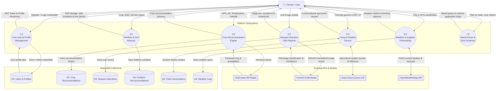

# KRISHI AI – Data Flow Diagram (DFD Level 1)

```mermaid
flowchart TD
    User["👨‍🌾 Farmer / User"]

    subgraph Processes["Platform Subsystems"]
        P1(("1.0\nUser Auth & Profile\nManagement"))
        P2(("2.0\nCrop Recommendation\nEngine"))
        P3(("3.0\nDisease Detection\nCNN Pipeline"))
        P4(("4.0\nFertilizer & Soil\nAdvisory"))
        P5(("5.0\nGroq AI Chatbot\nService"))
        P6(("6.0\nWeather & Irrigation\nForecasting"))
        P7(("7.0\nMandi Prices &\nGovt Schemes"))
    end

    subgraph DataStores["MongoDB Collections"]
        D_Users[("D1: Users & Profiles")]
        D_Crop[("D2: Crop Recommendations")]
        D_Disease[("D3: Disease Detections")]
        D_Fert[("D4: Fertilizer Recommendations")]
        D_Chat[("D5: Chat Conversations")]
        D_Weather[("D6: Weather Logs")]
    end

    subgraph ExternalServices["External APIs & Models"]
        M_Crop[["Scikit-learn RF Model"]]
        M_CNN[["PyTorch CNN Model"]]
        API_Groq[["Groq Cloud (Llama 3.3)"]]
        API_Weather[["OpenWeatherMap API"]]
    end

    %% Flows for P1
    User -->|Register / Login credentials| P1
    P1 -->|Store / Verify credentials| D_Users
    D_Users -->|User profile data| P1
    P1 -->|JWT Token & Profile Response| User

    %% Flows for P2
    User -->|NPK, pH, Temperature, Rainfall| P2
    P2 -->|Inference inputs| M_Crop
    M_Crop -->|Predicted crop & probabilities| P2
    P2 -->|Save recommendation history| D_Crop
    P2 -->|Crop recommendation advisory| User

    %% Flows for P3
    User -->|Leaf image upload| P3
    P3 -->|224x224 normalized image tensor| M_CNN
    M_CNN -->|Pathology classification & confidence| P3
    P3 -->|Save scan record| D_Disease
    P3 -->|Diagnosis, symptoms & treatments| User

    %% Flows for P4
    User -->|Crop, area, soil test values| P4
    P4 -->|Save fertilizer schedule| D_Fert
    P4 -->|RDF dosage, split schedule & lime advice| User

    %% Flows for P5
    User -->|Farming queries in EN / HI| P5
    P5 <-->|Session history context| D_Chat
    P5 <-->|Agricultural system prompt & inference| API_Groq
    P5 -->|Conversational agronomic answer| User

    %% Flows for P6
    User -->|City or GPS coordinates| P6
    P6 <-->|Fetch current weather & forecast| API_Weather
    P6 -->|Save weather query| D_Weather
    P6 -->|Weather metrics & farming advisory| User

    %% Flows for P7
    User -->|Filter by state, crop, district| P7
    P7 -->|Mandi prices & scheme application steps| User
```
