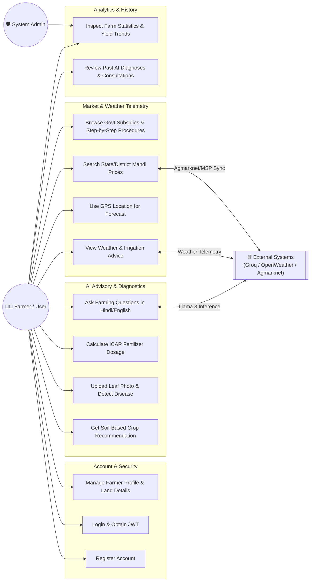

# KRISHI AI – Use Case Diagram

```mermaid
flowchart LR
    Farmer(("👨‍🌾 Farmer / User"))
    Admin(("🛡️ System Admin"))
    ExternalServices[["🌐 External Systems\n(Groq / OpenWeather / Agmarknet)"]]

    subgraph Authentication["Account & Security"]
        UC_Reg["Register Account"]
        UC_Login["Login & Obtain JWT"]
        UC_Profile["Manage Farmer Profile & Land Details"]
    end

    subgraph FarmingAI["AI Advisory & Diagnostics"]
        UC_CropRec["Get Soil-Based Crop Recommendation"]
        UC_DiseaseDet["Upload Leaf Photo & Detect Disease"]
        UC_Fertilizer["Calculate ICAR Fertilizer Dosage"]
        UC_Chatbot["Ask Farming Questions in Hindi/English"]
    end

    subgraph AgriculturalData["Market & Weather Telemetry"]
        UC_Weather["View Weather & Irrigation Advice"]
        UC_Geo["Use GPS Location for Forecast"]
        UC_Mandi["Search State/District Mandi Prices"]
        UC_Schemes["Browse Govt Subsidies & Step-by-Step Procedures"]
    end

    subgraph HistoryAndStats["Analytics & History"]
        UC_ViewHistory["Review Past AI Diagnoses & Consultations"]
        UC_Dash["Inspect Farm Statistics & Yield Trends"]
    end

    %% Farmer Associations
    Farmer --> UC_Reg
    Farmer --> UC_Login
    Farmer --> UC_Profile
    Farmer --> UC_CropRec
    Farmer --> UC_DiseaseDet
    Farmer --> UC_Fertilizer
    Farmer --> UC_Chatbot
    Farmer --> UC_Weather
    Farmer --> UC_Geo
    Farmer --> UC_Mandi
    Farmer --> UC_Schemes
    Farmer --> UC_ViewHistory
    Farmer --> UC_Dash

    %% External Associations
    UC_Chatbot <-->|Llama 3 Inference| ExternalServices
    UC_Weather <-->|Weather Telemetry| ExternalServices
    UC_Mandi <-->|Agmarknet/MSP Sync| ExternalServices

    %% Admin Associations
    Admin --> UC_Dash
```
